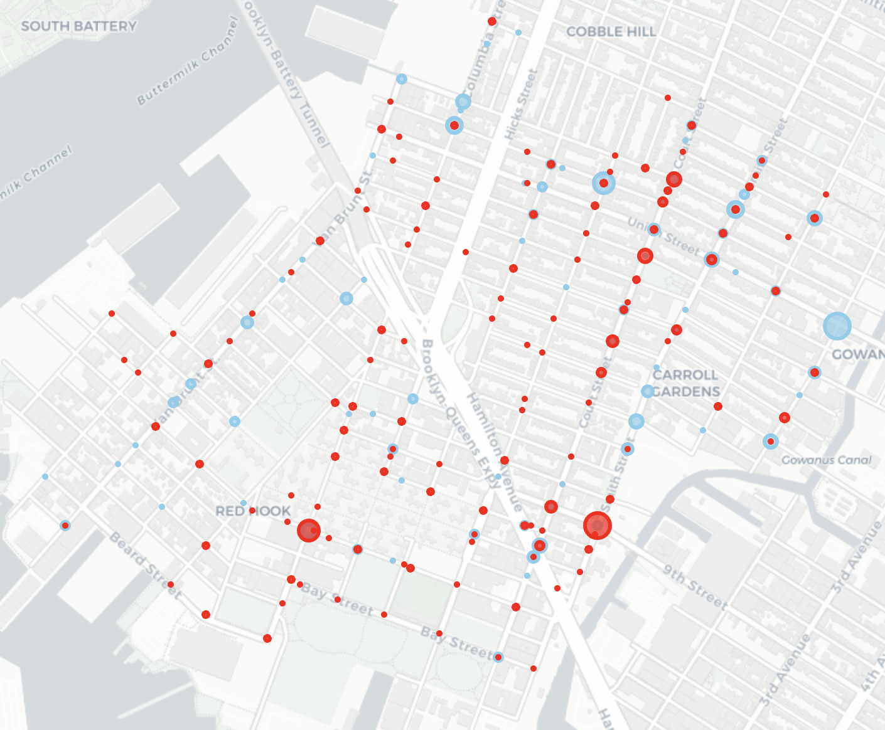
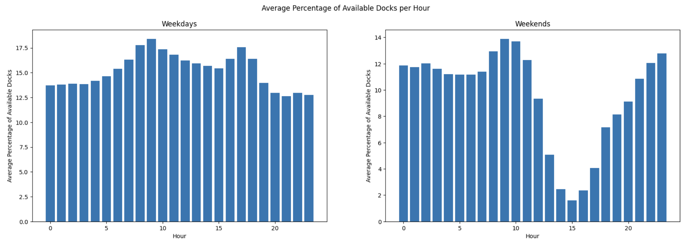
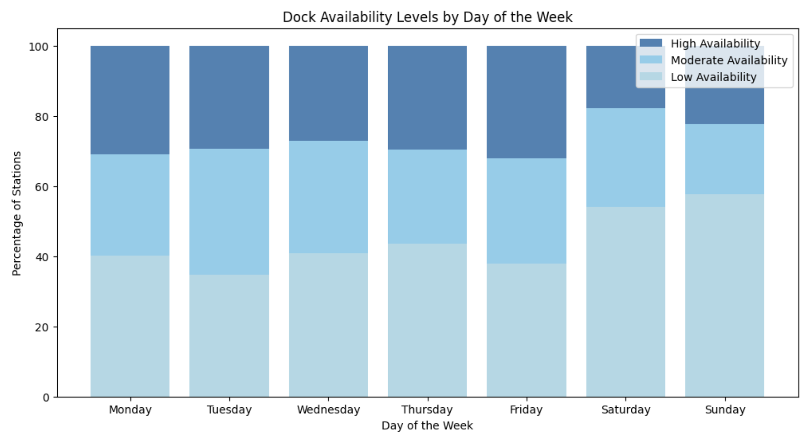
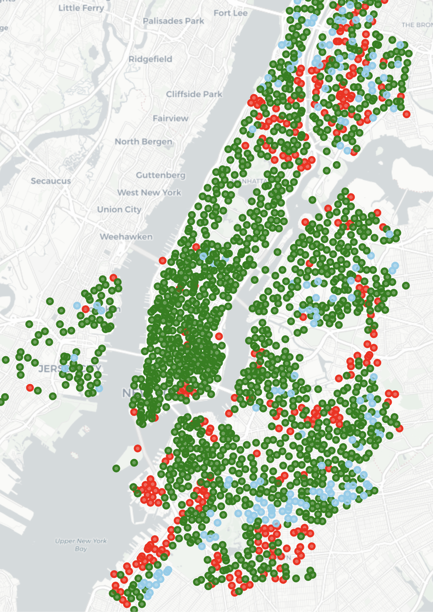
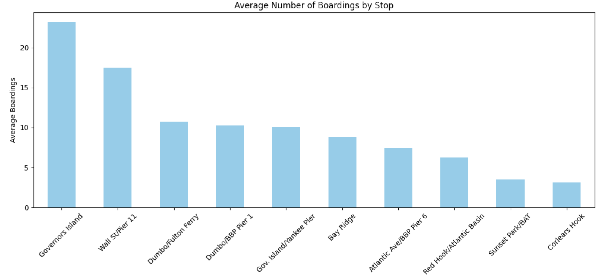

# OpenData 🗽

OpenData is a comprehensive collection of analyses and visualizations for various datasets related to New York City. It covers diverse topics, from traffic accidents to Citi Bike usage and ferry boardings. This repository serves as a window into various facets of city dynamics using open datasets.

## Table of Contents

- [Summary](#opendata-)
- [Accident Statistics](#accident-statistics)
- [Citi Bike Dock Usage](#citi-bike-dock-usage)
- [Ferry Boardings](#ferry-boardings)
- [Data Sources](#data-sources)

## Accident Statistics

Explore the details of accidents in NYC in the [notebooks/accidents.ipynb](notebooks/accidents.ipynb).

**Sample Visualization:**  
  
*Click on the image for a detailed view. Blue represents bikes and red represents pedestrians.*

For a comprehensive breakdown and more visual representations, refer to the [notebook](notebooks/accidents.ipynb).

## Citi Bike Dock Usage

Delve deep into Citi Bike dock usage in Red Hook through these dedicated Jupyter notebooks.

**Data Source:**  
See [documentation](docs/red-hook-time-series.md).

**Sample Visualizations:**

  
  
  
*In the heatmap, blue indicates limited bike availability while red suggests limited dock availability.*

To uncover the intricate details and discover more patterns, check out the notebooks:
- [Aggregate Analysis](notebooks/citi_bike_all.ipynb)
- [Single Day Analysis](notebooks/citi_bike_single_day.ipynb)

## Ferry Boardings

Learn about ferry boarding patterns and frequency in the [ferry notebook](notebooks/ferry.ipynb).

**Sample Visualization:**  

For an exhaustive analysis and more data visualizations, explore the [notebook](notebooks/ferry.ipynb).

## Data Sources

* [Most Popular NYC Open Data Sets](https://data.cityofnewyork.us/browse?sortBy=most_accessed&utf8=%E2%9C%93)
* [Accident Stats](https://data.cityofnewyork.us/Public-Safety/Motor-Vehicle-Collisions-Crashes/h9gi-nx95)
* [Ferry Boardings](https://data.cityofnewyork.us/Transportation/NYC-Ferry-Ridership/t5n6-gx8c)