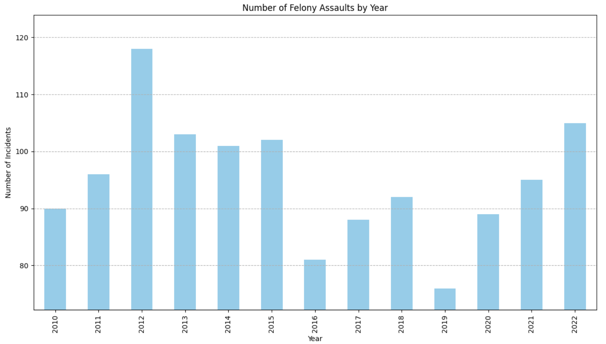
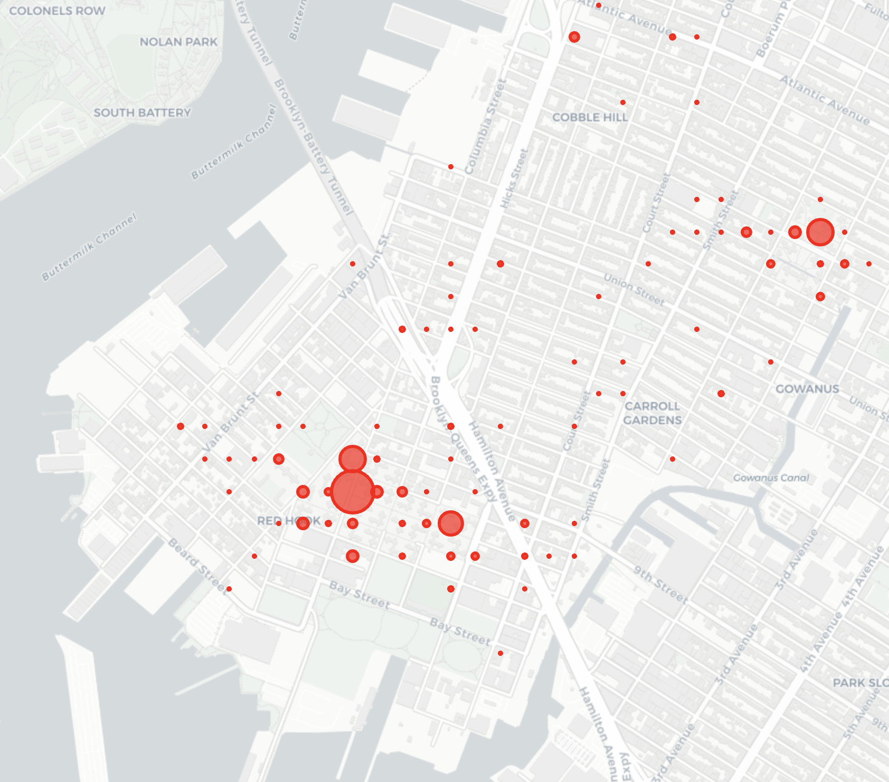
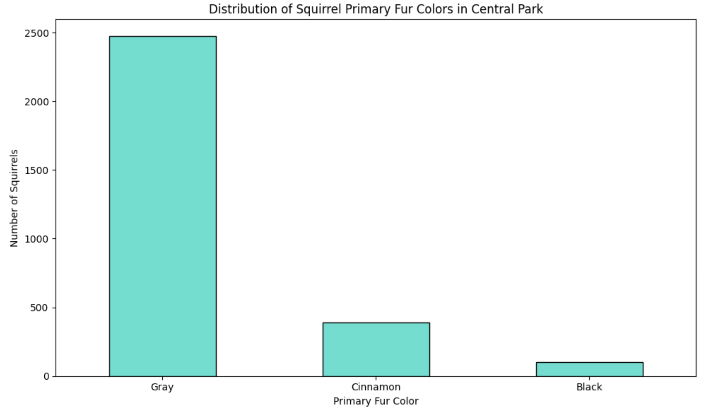

# OpenData 🗽

OpenData is a comprehensive collection of analyses and visualizations for various datasets related to New York City. It
covers diverse topics, from traffic accidents to Citi Bike usage and ferry boardings. This repository serves as a window
into various facets of city dynamics using open datasets.

## Table of Contents

- [Accident Statistics](#accident-statistics)
- [Citi Bike Dock Usage](#citi-bike-dock-usage)
- [Ferry Boardings](#ferry-boardings)
- [NYPD Complaints Analysis](#nypd-complaints-analysis)
- [Central Park Squirrel Census](#central-park-squirrel-census)
- [Data Sources](#data-sources)

## Accident Statistics

Explore the details of accidents in NYC in the [notebooks/accidents.ipynb](notebooks/accidents.ipynb).

**Sample Visualization:**  
  
*Accidents that resulted in injuries. Blue represents bikes and red represents pedestrians.*

For a comprehensive breakdown and more visual representations, refer to the [notebook](notebooks/accidents.ipynb).

## Citi Bike Dock Usage

Delve deep into Citi Bike dock usage in Red Hook through these dedicated Jupyter notebooks.

**Data Source:**  
See [documentation](docs/red-hook-time-series.md).

**Sample Visualizations:**

  
*Average dock availability in Red Hook Citi Bike stations by hour of the day*

*Dock availability levels in Red Hook by day of the week*

  
*In the heatmap, blue indicates limited bike availability while red suggests limited dock availability.*

To uncover the intricate details and discover more patterns, check out the notebooks:

- [Aggregate Analysis](notebooks/citi_bike_all.ipynb)
- [Single Day Analysis](notebooks/citi_bike_single_day.ipynb)

## Ferry Boardings

Learn about ferry boarding patterns and frequency in the [ferry notebook](notebooks/ferry.ipynb).

**Sample Visualization:**  

*Mean number of boardings at each station on the Southbound ferry route*

## NYPD Complaints Analysis

Dive into the analysis of NYPD complaints, specifically focusing on assault, in
the [NYPD Complaints notebook](notebooks/nypd_complaints.ipynb).

**Sample Visualizations:**  

*Assaults by year in the 76th precinct*

  
*Assault heatmap of the 76th precinct based on data since 2020*

For an in-depth analysis, detailed data wrangling, and other visualizations related to NYPD complaints, check out
the [notebook](notebooks/nypd_complaints.ipynb).

## Central Park Squirrel Census

The Central Park Squirrel Census provides a fascinating look into the behaviors and distribution of squirrels within
Central Park. This dataset offers insights into their primary fur colors, activities, and specific locations.

Sample Visualization:
  
*Distribution of squirrel sightings based on their primary fur color in Central Park*

For a comprehensive analysis and visualizations, check out the dedicated [notebook](notebooks/squirrel_census.ipynb).

## Data Sources

* [Most Popular NYC Open Data Sets](https://data.cityofnewyork.us/browse?sortBy=most_accessed&utf8=%E2%9C%93)
* [Accident Stats](https://data.cityofnewyork.us/Public-Safety/Motor-Vehicle-Collisions-Crashes/h9gi-nx95)
* [Ferry Boardings](https://data.cityofnewyork.us/Transportation/NYC-Ferry-Ridership/t5n6-gx8c)
* [NYPD Complaints](https://data.cityofnewyork.us/Public-Safety/NYPD-Complaint-Data-Historic/qgea-i56i)
* [Central Park Squirrel Sightings](https://data.cityofnewyork.us/Environment/2018-Central-Park-Squirrel-Census-Squirrel-Data/vfnx-vebw)